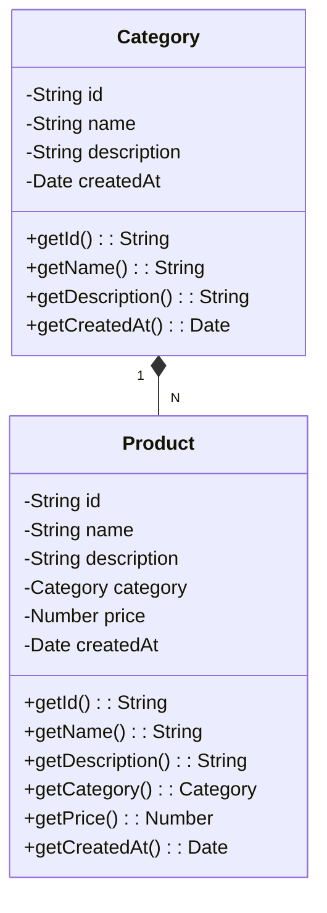

# Inventory Management System (CLI) 📋

This project is a Command Line Interface (CLI) based **Inventory Management System** built with **TypeScript**. The system allows the management of **categories** and **products** with **in-memory persistence**, meaning that the data will only exist during the execution of the program. 

## ⚙️ Features

The application provides the following functionality:

### 📊 UML Class Diagram

### Category Management
- **Create Category**: Add a new category to the system.
- **List Categories**: Display all the categories that have been added.
- **Search Category**: Find a category by its `id` or `name`.
- **Update Category**: Modify the details of an existing category.
- **Delete Category**: Remove a category from the system (categories with associated products cannot be deleted).

### Product Management
- **Create Product**: Add a new product to the system, associating it with an existing category.
- **List Products**: Display all the products that have been added.
- **Search Product**: Find a product by its `id`, `name`, or associated category.
- **Update Product**: Modify the details of an existing product.
- **Delete Product**: Remove a product from the system.

